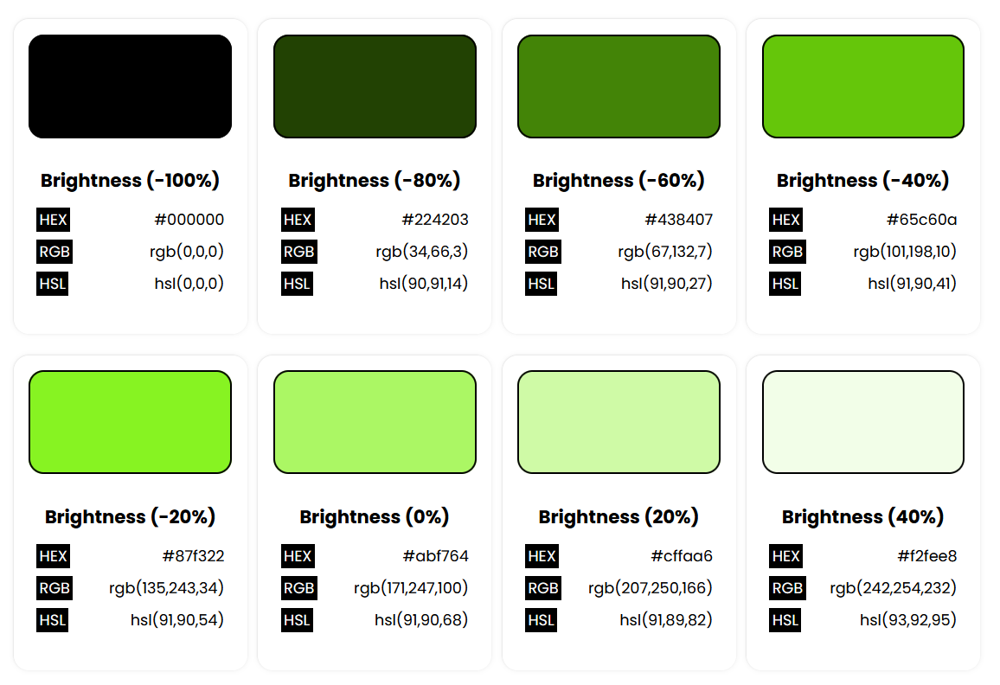
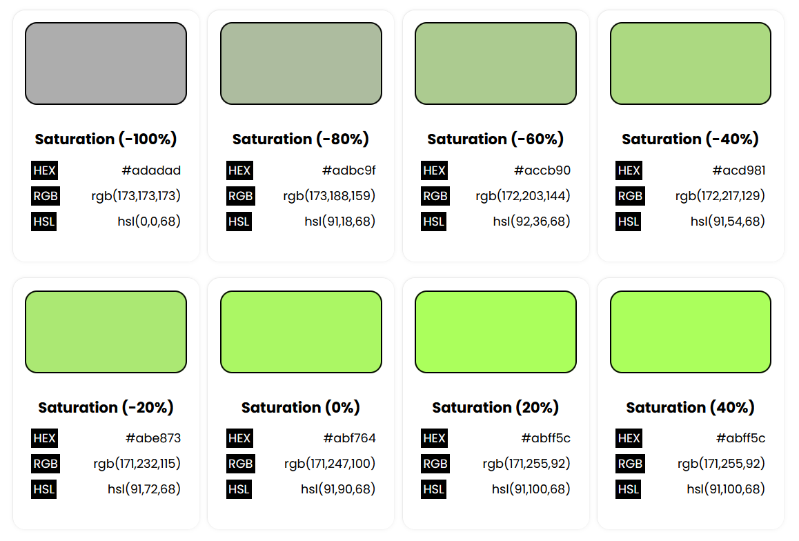
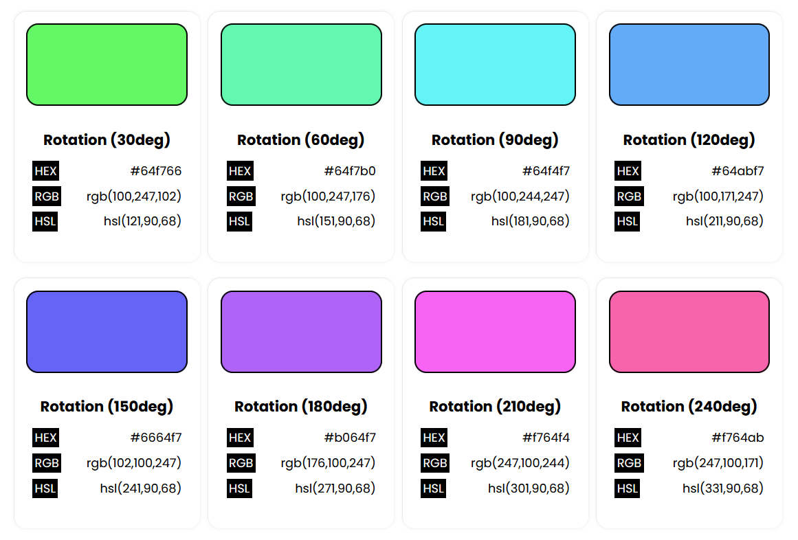
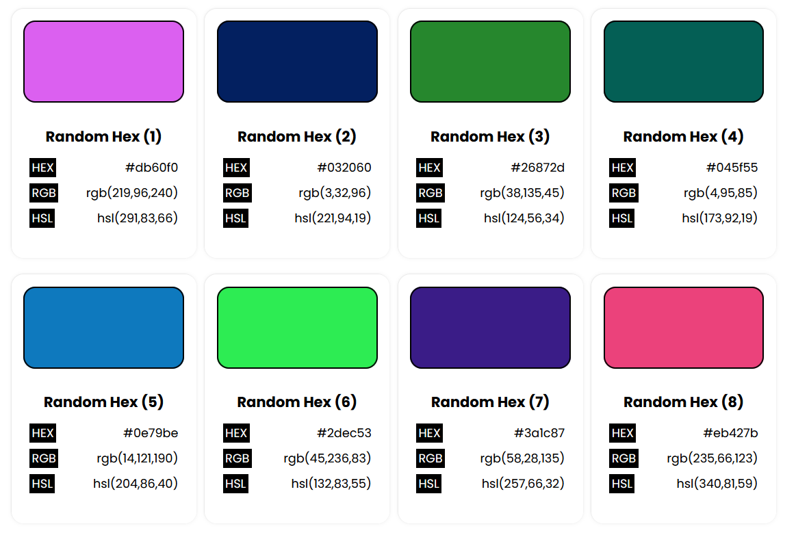
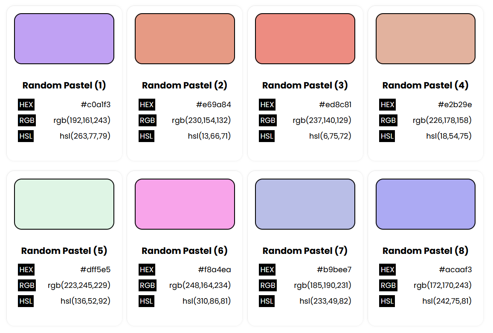
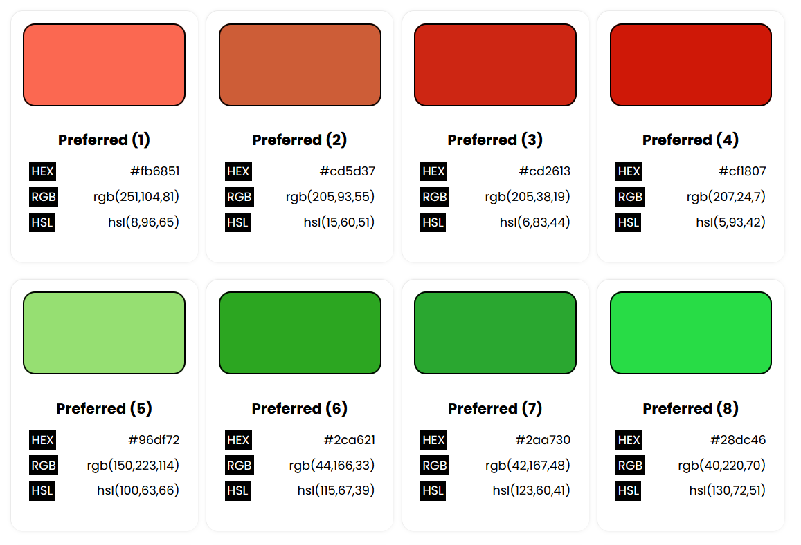
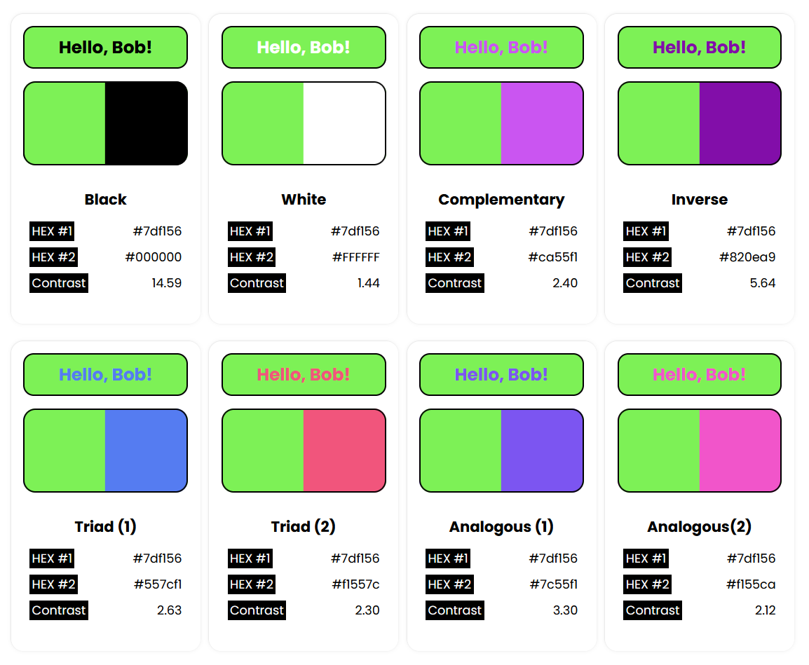
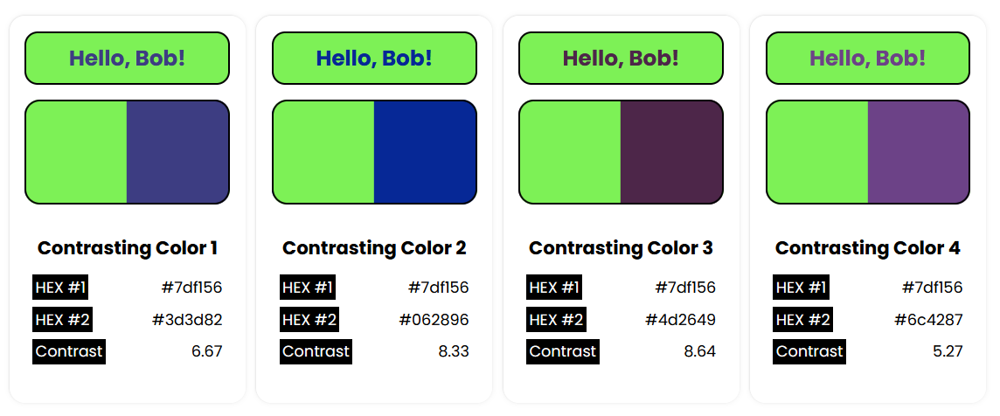

# Why did I Create `Colorful`?

I was looking for an easy-to-use color manipulation library for one of my projects. The library had to have these five features:

1. Do **color conversion** from one format to another like RGB to HSL, HSL to HEX etc.
2. Do **color manipulation** in a variety of ways like saturate or desaturate a color, make it brighter or duller, or change its hue. 
3. **Generate random colors** based on my preference like something greenish, or a pastel color etc.
4. **Generate a color palette** with complementary, analogous, or square counterparts of a given color.
5. **Suggest contrasting colors** that meet accessibility guidelines.

I couldn't find an existing library had these all features in a single package so I decided to create one myself.


## Installation

You can directly load Colorful on your webpage using the following HTML:

```
<script src="path/to/colorful.js"></script>
```

## Color Conversion

The library contains some static methods that you can use to do color conversion without needing to instantiate a `Colorful` object.

### Convert HEX to RGB

```
// Outputs: [ 134, 155, 82 ]
console.log(Colorful.hexToRgb('#869b52'));

// Outputs:rgb(134, 155, 82)
console.log(toString('rgb', Colorful.hexToRgb('#869b52')));
```

### Convert RGB to HEX

```
// Outputs:#11424e
console.log(Colorful.rgbToHex([ 134, 155, 82 ]));

// Outputs:#661478
console.log(Colorful.rgbStringToHex('rgb(102, 20, 120)));
```

### Converting HSL to RGB

```
// Outputs: [ 29, 237, 77 ]
console.log(Colorful.hslToRgb([ 134, 85, 52 ]));

// Outputs: rgb(29, 237, 77)
console.log(toString('rgb', Colorful.hslToRgb([ 134, 85, 52 ])));
```

### Converting RGB to HSL

```
// Outputs: [ 44, 81, 56 ]
console.log(Colorful.rgbToHsl([ 234, 185, 52 ]));

// Outputs: hsl(333deg, 78%, 63%)
console.log(toString('hsl', Colorful.rgbToHsl([ 234, 85, 152 ])));
```

## Color Manipulation

Once you instance a `Colorful` object with a HEX color value of your choice, you can make adjustments to its brightness or saturation.

The library converts HEX to HSL for adjusting brightness and saturation. 

- A color always becomes black when you reduce brightness by 100%.
- A color with 50% lightness becomes white when you make it brighter than 100%.
- Some colors might become white even before 100% brightness depending on their initial lightness.
- Others might require values higher than 100% to become white.

This happens because `adjustBrightness()` increases or decreases brightness by a certain percent instead of setting it at a certain percent.

A similar concept applies when manipulating saturation.

### Adjust Brightness



```
// Outputs: #e4d20b
console.log(new Colorful('#ae9f08').adjustBrightness(30));

// Outputs: #696105
console.log(new Colorful('#AE9F08').adjustBrightness(-40)); 
```

### Adjust Saturation



```
// Outputs: #1acb1d
console.log(new Colorful('#34b137').adjustSaturation(40));

// Outputs: #4d994e
console.log(new Colorful('#34b137').adjustSaturation(-40));
```

### Rotate Hue



```
// Outputs: #3eb80a
console.log(new Colorful('#b90a3f').rotateHue(120));

// Outputs: #2d0ab8
console.log(new Colorful('#b90a3f').rotateHue(-90));
```

## Generate Random Colors

There are three different static methods in the `Colorful` class to generate random colors depending on your requirements.

### Random HEX Color



The `getRandomHexColor()` method will give the HEX value for a random color.

```
// Outputs: #c4060f
console.log(Colorful.getRandomHexColor());
```

### Random Pastel Color



Use `getRandomPastelColor()` if you want to generate lighter colors. This method also gives back a HEX string.

```
// Outputs: #e6a2e7
console.log(Colorful.getRandomPastelColor());
```

### Random Preferred Color



The most versatile method in `Colorful` to generate random colors is `getPreferredColor()`. It accepts a string or object as its parameter to generate a random color.

Skip the parameter if you want to generate a random color.

```
// Outputs: #58cffe
console.log(Colorful.getRandomPreferredColor());

// Outputs: #db7357
console.log(Colorful.getRandomPreferredColor('reddish'));

// Outputs: #2fb125
console.log(Colorful.getRandomPreferredColor({hueRange: [100, 160]}));
```

## Generate Color Palette

You can also generate a color palette based on the color which instantiated the `Colorful` object.

Here are some examples:

```
var myColor = new Colorful('#F09A16');

// Outputs: [ "#daf014", "#f02a14" ]
console.log(myColor.getAnalogousColors());

// Outputs: [ "#14f098", "#9814f0" ]
console.log(myColor.getTriadColors());

// Outputs: [ "#14f02a", "#146cf0", "#f014da" ]
console.log(myColor.getSquareColors());

// Outputs: [ "#6cf014", "#146cf0", "#9814f0" ]
console.log(myColor.getRectangleColors());

// Outputs: #0f65e9
console.log(myColor.getInverseColor());

// Outputs: #146cf0
console.log(myColor.getComplementaryColor());

// Outputs: [ "#14daf0", "#2a14f0" ]
console.log(myColor.getSplitComplementaryColors());

// Outputs: [ "#332004", "#5c3a07", "#7a4d0a", "#f7ac3b", "#facb85" ]
console.log(myColor.getMonochromaticColors());
```

## Accessibility Calculations

You can use `Colorful` to get some suggestions on background color for white or black text in particular or any other color in general. It is also possible to calculate the contrast between any two colors for other purposes.

### Calculate Contrast Between Colors



If you are planning to use tow colors together, it might be beneficial to know the contrast between them. Use the `getContrast()` method in `Colorful` to do so.

```
let myColor = new Colorful('#A89AFF');

// Outputs: 1.12
console.log(myColor.getContrast('#F90'));
```

### Get Color Suggestions above Contrast Threshold



If you just want `Colorful` to suggest random colors that have a contrast with the color of the instantiated `Colorful` object above the specified threshold, use the `getContrastingColor()` method.

```
let myColor = new Colorful('#A89AFF');

// Outputs: #0c1d44
console.log(myColor.getContrastingColor(5.2));
```

### Get colors that are Accessible with Black or White

Colors should have a contrast of at least 4.52 between them to be accessible. If you plan on using white or black for either the foreground or background, consider using `getWhiteAccessibleColor()` and `getBlackAccessibleColor()`.

```
// #9a2ddd
console.log(Colorful.getWhiteAccessibleColor());

// #79f1af
console.log(Colorful.getBlackAccessibleColor());
```

### Check if a Color is Dark or Light

Sometimes, you might want to check if a color is light or dark before using it for text or background. You can do so with ease with the help of `isDark()` and `isLight()`.

```
let myColor = new Colorful('#A0BD93');

// Outputs: false
console.log(myColor.isLight());

// Outputs: true
console.log(myColor.isDark());

let brightColor = new Colorful(myColor.adjustBrightness(50));

// Outputs: true
console.log(brightColor.isLight());
```

## Upcoming Features

1. A better algorithm to generate monochromatic colors.
2. Support for instantiating a `Colorful` object through other color formats besides HEX.
3. Add support for Alpha channel. (Done)

If you have any other suggestions, I would be glad to hear them.


